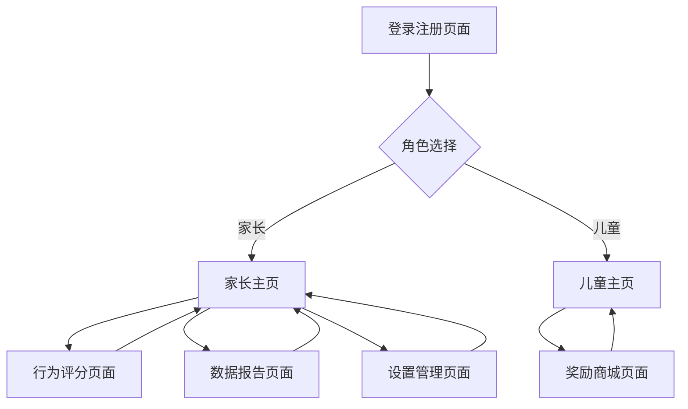

# 儿童行为管理APP产品需求文档

## 1. Product Overview

儿童行为管理APP是一款帮助家长培养孩子良好行为习惯的移动应用，通过积分奖励机制激励儿童积极表现。

* 解决家长在儿童行为管理中缺乏有效工具和激励机制的问题，为家庭教育提供数字化解决方案。

* 目标市场为有3-12岁儿童的家庭，预期通过科学的行为管理方式提升家庭教育效果。

## 2. Core Features

### 2.1 User Roles

| Role | Registration Method | Core Permissions      |
| ---- | ------------------- | --------------------- |
| 家长用户 | 手机号注册登录             | 创建儿童账户、行为评分、设置奖励、查看报告 |
| 儿童用户 | 家长端创建账户             | 查看积分、兑换奖励、查看行为记录      |

### 2.2 Feature Module

我们的儿童行为管理APP包含以下主要页面：

1. **登录注册页面**：用户身份验证、角色选择。
2. **家长主页**：儿童列表、快速评分、数据概览。
3. **行为评分页面**：行为分类选择、加减分操作、评价记录。
4. **儿童主页**：积分显示、奖励展示、成就徽章。
5. **奖励商城页面**：奖励列表、积分兑换、兑换记录。
6. **数据报告页面**：行为趋势图表、周月统计、进步分析。
7. **设置管理页面**：账户管理、奖励设置、行为分类配置。

### 2.3 Page Details

| Page Name | Module Name | Feature description       |
| --------- | ----------- | ------------------------- |
| 登录注册页面    | 身份验证模块      | 手机号登录注册、角色切换（家长/儿童）、密码找回  |
| 家长主页      | 儿童管理模块      | 显示所有儿童列表、当前积分状态、快速加减分按钮   |
| 家长主页      | 数据概览模块      | 今日行为统计、本周进步情况、待处理事项提醒     |
| 行为评分页面    | 行为分类模块      | 预设行为分类（学习、生活、社交等）、自定义行为项目 |
| 行为评分页面    | 评分操作模块      | 加分减分按钮、分值设置、行为描述输入、照片上传   |
| 儿童主页      | 积分展示模块      | 当前总积分、今日获得积分、积分变化动画效果     |
| 儿童主页      | 成就系统模块      | 徽章展示、等级进度条、里程碑奖励          |
| 奖励商城页面    | 奖励列表模块      | 奖励分类展示、积分价格标注、库存状态显示      |
| 奖励商城页面    | 兑换功能模块      | 积分扣除、兑换确认、兑换历史记录          |
| 数据报告页面    | 统计图表模块      | 行为趋势折线图、积分变化柱状图、分类占比饼图    |
| 数据报告页面    | 分析报告模块      | 周月报告生成、进步建议、行为模式分析        |
| 设置管理页面    | 账户设置模块      | 个人信息修改、密码更改、儿童账户管理        |
| 设置管理页面    | 系统配置模块      | 奖励项目设置、行为分类管理、积分规则配置      |

## 3. Core Process

**家长用户流程：**
家长注册登录后进入主页，可以查看所有儿童的积分状态。当需要对儿童行为进行评价时，选择对应儿童进入行为评分页面，选择行为分类并进行加减分操作。家长可以在数据报告页面查看儿童的行为趋势和进步情况，在设置页面管理奖励项目和行为分类。

**儿童用户流程：**
儿童通过家长创建的账户登录，进入专属的儿童主页查看当前积分和获得的成就徽章。当积分足够时，可以进入奖励商城页面浏览并兑换心仪的奖励。儿童也可以查看自己的行为记录和进步情况。



## 4. User Interface Design

### 4.1 Design Style

* **主色调**：温暖的橙色(#FF6B35)作为主色，柔和的蓝色(#4A90E2)作为辅助色

* **按钮样式**：圆角矩形按钮，具有轻微阴影效果，点击时有缩放动画

* **字体**：中文使用苹方字体，英文使用Roboto，主标题18px，正文14px

* **布局风格**：卡片式设计，顶部导航栏，底部Tab切换

* **图标风格**：使用可爱的卡通风格图标，配合彩色emoji表情增加趣味性

### 4.2 Page Design Overview

| Page Name | Module Name | UI Elements                    |
| --------- | ----------- | ------------------------------ |
| 登录注册页面    | 身份验证模块      | 简洁白色背景，居中登录表单，橙色登录按钮，底部角色切换Tab |
| 家长主页      | 儿童管理模块      | 顶部欢迎语，儿童头像卡片网格布局，每个卡片显示姓名和当前积分 |
| 家长主页      | 数据概览模块      | 统计数据卡片横向排列，使用图标和数字组合，柔和背景色区分   |
| 行为评分页面    | 行为分类模块      | 彩色分类标签，网格布局，每个分类配有相应图标         |
| 行为评分页面    | 评分操作模块      | 大号加减分按钮，绿色加分红色减分，中央显示当前分值      |
| 儿童主页      | 积分展示模块      | 大号积分数字居中显示，金币图标装饰，彩虹色进度条       |
| 儿童主页      | 成就系统模块      | 徽章网格展示，已获得徽章彩色显示，未获得灰色显示       |
| 奖励商城页面    | 奖励列表模块      | 商品卡片瀑布流布局，商品图片、名称、积分价格清晰展示     |
| 数据报告页面    | 统计图表模块      | 彩色图表，使用Chart.js库，背景白色，数据点突出显示  |
| 设置管理页面    | 系统配置模块      | 列表式布局，每项设置带有图标，右侧箭头指示可点击       |

### 4.3 Responsiveness

应用采用移动端优先设计，主要适配iOS和Android手机屏幕，支持竖屏和横屏切换。针对触摸操作进行优化，按钮大小不小于44px，支持手势滑动和长按操作。

## 5. 后端技术架构

### 5.1 技术栈选择

* **开发语言**：Go 1.19+

* **Web框架**：Gin框架，提供高性能HTTP服务

* **数据库**：MySQL 8.0（主数据库）+ 内存缓存

* **ORM框架**：GORM，简化数据库操作

* **认证方式**：JWT Token认证

* **文件存储**：本地存储或阿里云OSS

* **日志系统**：Logrus结构化日志

* **配置管理**：Viper配置文件管理

### 5.2 项目结构

```
backend/
├── cmd/
│   └── server/
│       └── main.go          # 程序入口
├── internal/
│   ├── api/
│   │   ├── handlers/        # 路由处理器
│   │   ├── middleware/      # 中间件
│   │   └── routes/          # 路由定义
│   ├── models/              # 数据模型
│   ├── services/            # 业务逻辑层
│   ├── repository/          # 数据访问层
│   └── utils/               # 工具函数
├── configs/                 # 配置文件
├── migrations/              # 数据库迁移文件
├── docs/                    # API文档
└── go.mod
```

### 5.3 数据库设计

#### 用户表 (users)

| 字段名         | 类型                     | 说明     | 约束        |
| ----------- | ---------------------- | ------ | --------- |
| id          | bigint                 | 用户ID   | 主键，自增     |
| phone       | varchar(20)            | 手机号    | 唯一，非空     |
| password    | varchar(255)           | 密码哈希   | 非空        |
| nickname    | varchar(50)            | 昵称     | 非空        |
| avatar      | varchar(255)           | 头像URL  | 可空        |
| role        | enum('parent','child') | 用户角色   | 非空        |
| parent\_id  | bigint                 | 父级用户ID | 外键，儿童用户必填 |
| created\_at | timestamp              | 创建时间   | 非空        |
| updated\_at | timestamp              | 更新时间   | 非空        |

#### 行为记录表 (behavior\_records)

| 字段名            | 类型           | 说明     | 约束    |
| -------------- | ------------ | ------ | ----- |
| id             | bigint       | 记录ID   | 主键，自增 |
| child\_id      | bigint       | 儿童用户ID | 外键，非空 |
| parent\_id     | bigint       | 家长用户ID | 外键，非空 |
| behavior\_type | varchar(50)  | 行为类型   | 非空    |
| behavior\_desc | varchar(255) | 行为描述   | 非空    |
| score\_change  | int          | 积分变化   | 非空    |
| image\_url     | varchar(255) | 图片URL  | 可空    |
| created\_at    | timestamp    | 创建时间   | 非空    |

#### 积分表 (user\_points)

| 字段名               | 类型        | 说明   | 约束     |
| ----------------- | --------- | ---- | ------ |
| id                | bigint    | 记录ID | 主键，自增  |
| user\_id          | bigint    | 用户ID | 外键，非空  |
| total\_points     | int       | 总积分  | 非空，默认0 |
| available\_points | int       | 可用积分 | 非空，默认0 |
| updated\_at       | timestamp | 更新时间 | 非空     |

#### 奖励表 (rewards)

| 字段名          | 类型           | 说明    | 约束        |
| ------------ | ------------ | ----- | --------- |
| id           | bigint       | 奖励ID  | 主键，自增     |
| parent\_id   | bigint       | 创建者ID | 外键，非空     |
| name         | varchar(100) | 奖励名称  | 非空        |
| description  | text         | 奖励描述  | 可空        |
| points\_cost | int          | 所需积分  | 非空        |
| image\_url   | varchar(255) | 奖励图片  | 可空        |
| stock        | int          | 库存数量  | 非空，默认1    |
| is\_active   | boolean      | 是否启用  | 非空，默认true |
| created\_at  | timestamp    | 创建时间  | 非空        |

#### 兑换记录表 (exchange\_records)

| 字段名          | 类型                                      | 说明     | 约束    |
| ------------ | --------------------------------------- | ------ | ----- |
| id           | bigint                                  | 记录ID   | 主键，自增 |
| child\_id    | bigint                                  | 儿童用户ID | 外键，非空 |
| reward\_id   | bigint                                  | 奖励ID   | 外键，非空 |
| points\_used | int                                     | 使用积分   | 非空    |
| status       | enum('pending','completed','cancelled') | 兑换状态   | 非空    |
| created\_at  | timestamp                               | 创建时间   | 非空    |

## 6. API接口规范

### 6.1 认证接口

#### POST /api/auth/register

**功能**：用户注册
**请求参数**：

```json
{
  "phone": "13800138000",
  "password": "123456",
  "nickname": "张三",
  "role": "parent"
}
```

**响应示例**：

```json
{
  "code": 200,
  "message": "注册成功",
  "data": {
    "user_id": 1,
    "token": "eyJhbGciOiJIUzI1NiIs..."
  }
}
```

#### POST /api/auth/login

**功能**：用户登录
**请求参数**：

```json
{
  "phone": "13800138000",
  "password": "123456"
}
```

### 6.2 用户管理接口

#### POST /api/users/children

**功能**：创建儿童账户
**请求头**：Authorization: Bearer {token}
**请求参数**：

```json
{
  "nickname": "小明",
  "avatar": "http://example.com/avatar.jpg"
}
```

#### GET /api/users/children

**功能**：获取儿童列表
**请求头**：Authorization: Bearer {token}
**响应示例**：

```json
{
  "code": 200,
  "data": [
    {
      "id": 2,
      "nickname": "小明",
      "avatar": "http://example.com/avatar.jpg",
      "total_points": 150,
      "available_points": 120
    }
  ]
}
```

### 6.3 行为管理接口

#### POST /api/behaviors

**功能**：记录行为评分
**请求头**：Authorization: Bearer {token}
**请求参数**：

```json
{
  "child_id": 2,
  "behavior_type": "学习",
  "behavior_desc": "主动完成作业",
  "score_change": 10,
  "image_url": "http://example.com/photo.jpg"
}
```

#### GET /api/behaviors

**功能**：获取行为记录
**请求头**：Authorization: Bearer {token}
**查询参数**：

* child\_id: 儿童ID

* start\_date: 开始日期

* end\_date: 结束日期

* page: 页码

* limit: 每页数量

### 6.4 积分管理接口

#### GET /api/points/{user\_id}

**功能**：获取用户积分
**请求头**：Authorization: Bearer {token}
**响应示例**：

```json
{
  "code": 200,
  "data": {
    "total_points": 150,
    "available_points": 120
  }
}
```

### 6.5 奖励管理接口

#### POST /api/rewards

**功能**：创建奖励
**请求头**：Authorization: Bearer {token}
**请求参数**：

```json
{
  "name": "看电影",
  "description": "周末看一场电影",
  "points_cost": 50,
  "stock": 1
}
```

#### GET /api/rewards

**功能**：获取奖励列表
**请求头**：Authorization: Bearer {token}

#### POST /api/rewards/{reward\_id}/exchange

**功能**：兑换奖励
**请求头**：Authorization: Bearer {token}

### 6.6 统计报告接口

#### GET /api/statistics/behavior-trend

**功能**：获取行为趋势数据
**请求头**：Authorization: Bearer {token}
**查询参数**：

* child\_id: 儿童ID

* period: 统计周期（week/month）

### 6.7 文件上传接口

#### POST /api/upload

**功能**：上传图片文件
**请求头**：Authorization: Bearer {token}
**请求类型**：multipart/form-data
**响应示例**：

```json
{
  "code": 200,
  "data": {
    "url": "http://example.com/uploads/image.jpg"
  }
}
```

## 7. 安全与性能

### 7.1 安全措施

* **密码加密**：使用bcrypt对密码进行哈希加密

* **JWT认证**：使用JWT Token进行用户身份验证，设置合理的过期时间

* **参数验证**：对所有API请求参数进行严格验证

* **SQL注入防护**：使用GORM的参数化查询防止SQL注入

* **跨域处理**：配置CORS中间件，限制允许的域名

* **请求限流**：使用中间件限制API请求频率

### 7.2 性能优化

* **数据库索引**：为常用查询字段添加索引

* **内存缓存**：缓存用户信息、积分数据等热点数据

* **分页查询**：对列表接口实现分页，避免一次性加载大量数据

* **图片压缩**：上传图片时进行压缩处理

* **连接池**：配置数据库连接池，提高并发处理能力

### 7.3 部署配置

* **环境配置**：支持开发、测试、生产环境配置

* **日志管理**：结构化日志记录，支持日志轮转

* **健康检查**：提供健康检查接口

* **优雅关闭**：支持服务优雅关闭

* **传统部署**：提供systemd服务配置

